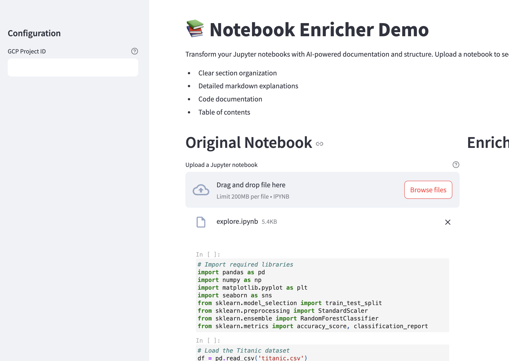

# Notebook Structure Enricher

This Python utility reads a Jupyter Notebook, analyzes its structure using Gemini model, and then outputs a new notebook that includes an introduction, sections with markdown documentation, and a table of contents. It helps you create a more organized and documented notebook by:

- Inferring logical sections from the code cells.
- Generating introductory text and section overviews.
- Automatically inserting markdown to provide context and documentation for each section.

---

## Table of Contents
1. [Features](#features)
2. [Requirements](#requirements)
3. [Usage](#usage)
4. [Code Explanation](#code-explanation)
5. [License](#license)

---

## Features
- **Automated Notebook Structuring**: The code reads all notebook cells, runs a large language model prompt to determine logical sections, and creates an organized structure.
- **Section Documentation**: Generates concise markdown descriptions for each section, focusing on conceptual explanations rather than line-by-line breakdowns.
- **Table of Contents**: Inserts an automatic table of contents for easy navigation.
- **Vertex AI Integration**: Uses Vertex AI and Gemini Model to analyze code content.

---

## Requirements
1. **Python 3.7++**  
2. **Jupyter Notebook**  
3. **Google Cloud Project** with Vertex AI API enabled
4. **Installed Python Dependencies**:
   - `google-cloud-aiplatform`
   - `nbformat`
   - `nbconvert`
   - `tqdm`
   - `streamlit`

Ensure that `pip install -r requirements.txt` is run before using this script.

---

## Usage - Script mode
1. **Set up a Google Cloud Project** with Vertex AI:
   - Enable the [Vertex AI API](https://cloud.google.com/vertex-ai).
   - Create or use an existing service account with the necessary permissions to call Vertex AI.

2. **Authenticate Your Environment**:
   - Use `gcloud auth login` on your local machine or set up the service account credentials, e.g.,
     ```bash
     export GOOGLE_APPLICATION_CREDENTIALS="path/to/your/service-account-key.json"
     ```

3. **Edit the Script**:
   - Update `project_id`, `location`, `input_notebook_path`, and `output_notebook_path` in the `if __name__ == "__main__":` block to suit your environment and file paths.

4. **Run the Script**:
   ```bash
   python your_script_name.py

## Usage - Streamlit app



**Run the Script**:
   ```bash
   streamlit run app.py
